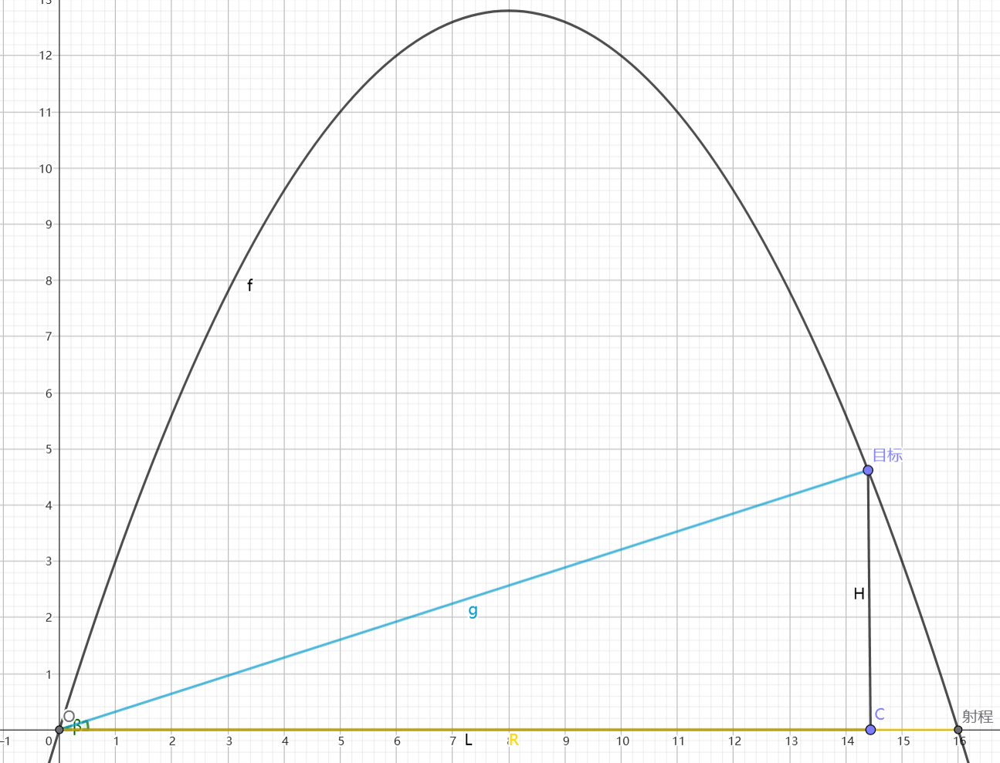
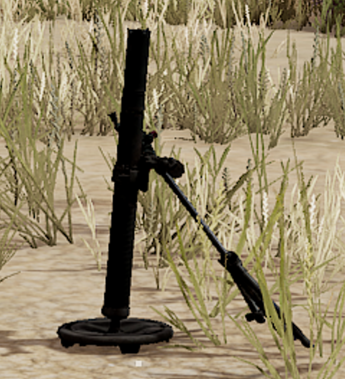
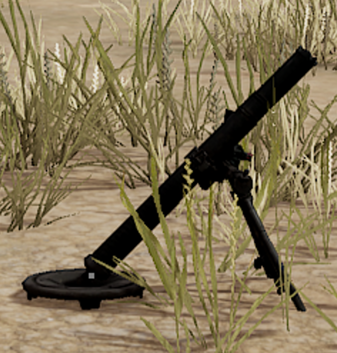

# Mortar Aid For PUBG

PUBG迫击炮辅助工具

## 声明

仅用于技术交流和娱乐目的

## 基本原理

1. 标准网格100米比例尺缩放
2. 仰角高程修正

首先是斜抛运动方程和仰角的几何关系联立:

```math

y = - \frac{g}{2v_0^2 \cos^2{\theta}} x^2 + x\tan{\theta}
\\
\tan{\beta} = \frac{H}{L}

```

其中 $\theta$ 为迫击炮仰角， $v_0$ 为迫击炮初速度， $g$ 为重力加速度

我们需要的是 $R$ ，也就是本工具测量的值。



如果是低打高，包含仰角 $\beta$

在PUBG中，迫击炮最远距离`700m`的仰角是45°

(未精确测试，对比图如下)

121m射程仰角较大



700m射程仰角为45°，符合斜抛运动方程



所以当我们带入仰角 $\theta = 45°$

有

```math

R = \frac{v_0^2\sin{2\theta}}{g} = \frac{v_0^2}{g}

```

$R$ 这里表示理论最大射程（同一水平面下，迫击炮打到的直线距离）

到这里就足够了，严格来说不能带入地球的`g`

毕竟我也不知道PUBG的引擎里面是否有重力加速度，如果有，是否和地球一样呢？

不过考虑到最后的量纲，不需要考虑`g`的取值

目标位置是 $(L, H)$ 把 $R = \frac{v_0^2\sin{2\theta}}{g}$ 带入到斜抛运动方程

可以得到 $\theta$ 关于 $H$ 和 $L$ 的表达式

```math

\tan{\theta} = \frac{H}{L - \frac{L^2}{R}}

```

带回方程可以得到:

```math
R = \frac{\frac{HLv_0^2}{g} + L^3 ± \sqrt{(\frac{HLv_0^2}{g}  + L^3)^2 - (H^2 + L^2)(L^4 + \frac{2HLv_0^2}{g})}}{H^2 + L^2}
```

利用仰角 $\beta$ 的 $\tan{\beta} = \frac{H}{L}$

同时，记 $M = \frac{v_0^2}{g}$ （也就是迫击炮最远射程700m，不需要单独计算 $v_0$ 以防误差累积）

得到最终化简结果:


```math
R = \frac{L + tan{\beta}(M - \sqrt{M^2 - 2LM\tan{\beta} - L^2})}{\tan^2{\beta} + 1}
```

问题最终转为，已知水平距离 $L$ 和目标仰角 $\beta$ 求迫击炮应该设置的值 $R$

所以程序最终转为求 $L$ 和 $\beta$


* $L$ 用比例尺

* $R$ 用仰角表（数据详情参考[1]）

## 使用方法

```bash
pyinstaller --onefile --windowed --name "MortarAid" --icon=img/icon.ico .\main.py
```

或者直接下载 `release`

---

Alt + Q: 开始测距

Alt + Left: 开始标点

先标出一百米网格的像素距离，工具会计算比例尺。

然后再标出自己的点和目标点。

最后标出目标点在屏幕上的位置，工具会根据仰角表计算仰角。

最后工具输出迫击炮的射程。

## 参考文献

> 参考文献：
> 
> [1] 绝地King-of-Mortar. 《PUBG迫击炮开炮密位公式推导》. 小黑盒, 2025-01-03. [link](https://api.xiaoheihe.cn/v3/bbs/app/api/web/share?link_id=b7a56f9c397c)
> 
> [2] 一只黄小娥. Bilibili, 2024-10-03 [link](https://www.bilibili.com/video/BV1Ub4VeyEFA/?vd_source=56c580e6d408a69243bf3cc1af31f92d)
